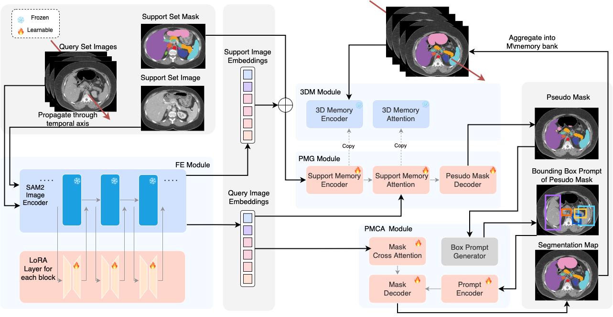

<h1 align="center">● SAM2-SGP: Enhancing SAM2 for Medical Image Segmentation via Support-Set Guided Prompting</h1>

<font size=3><div align='center' > <a href=https://arxiv.org/abs/2506.19658>**Paper**</a> | [**Datasets**](#Datasets) | [**Model**](#Pre-trained\nWeights) | [**Training**](#Training) | [**Evaluation**](#Testing)</div></font>


SAM2-SGP is a customized segmentation model that utilizes the [SAM 2](https://github.com/facebookresearch/segment-anything-2) framework to address both 2D and 3D medical image segmentation tasks without requring manual prompts. This method is elaborated based on the paper [SAM2-SGP: Enhancing SAM2 for Medical Image Segmentation via Support-Set Guided Prompting](https://arxiv.org/abs/2506.19658).

## Model Architecture



##  Requirement

 Install the environment:

 ``conda env create -f environment.yml``

 ``conda activate sam2_sap``

 You can download SAM2 checkpoint from checkpoints folder:
 
 ``bash download_ckpts.sh``

 Further Note: We tested on the following system environment and you may have to handle some issue due to system difference.
```
Operating System: Ubuntu 22.04
Conda Version: 24.3.0
Python Version: 3.12.4
Torch Version: 12.4.1
```
## Datasets
Most of our datasets we use are public datasets. We adopt the BioMedParse Dataset, which has acquired datasets including
[CAMUS](https://www.creatis.insa-lyon.fr/Challenge/camus/index.html), 
[Amos22](https://amos22.grand-challenge.org/) ,
[ACDC](https://www.creatis.insa-lyon.fr/Challenge/acdc/databases.html),
[BUSI](https://scholar.cu.edu.eg/?q=afahmy/pages/dataset),
[REFUGE](https://bitbucket.org/woalsdnd/refuge/src). Full datasets can be downloaded via [hugging face link](https://huggingface.co/datasets/microsoft/BiomedParseData).


 ## Pre-trained Weights

### 3D weights will be released on [HuggingFace](https://huggingface.co)
 ## Training
 
 ### 2D case - CAMUS Ultrasound Segmentation

**Step1:** Run the training by:

``python train_2d.py -net sam2 -exp_name WBC_Abl_Support16 -vis 999 -sam_ckpt ./checkpoints/sam2_hiera_small.pt -sam_config sam2_hiera_s -image_size 256 -out_size 256 -b 8 -val_freq 5 -dataset WBC -data_path /data_path/data/WBC/ -support_size 1 -lr 1e-3``

 **Step2:** Run the validation by:
 
``python evaluation_2d.py -net sam2 -exp_name WBC_Abl_Support16 -vis 999 -sam_ckpt ./checkpoints/sam2_hiera_small.pt -sam_config sam2_hiera_s -image_size 256 -out_size 256 -b 8 -val_freq 5 -dataset WBC -data_path /data_path/data/WBC/ -support_size 1 -lr 1e-3``

 ### 3D case - Amos22 Multi-organ CT&MRI Segmentation
 
 **Single GPU:** Run the training by:

``python train_3d.py -net sam2 -exp_name AMOS_float32 -sam_ckpt ./checkpoints/sam2_hiera_small.pt -sam_config sam2_hiera_s -image_size 1024 -out_size 1024 -val_freq 3 -prompt bbox -dataset amos -data_path /data_path/data/amos22/MRI/ -video_length 10 -lr 1e-2 -vis 99 -b 2 -support_size 4 -task left+kidney``

**Multi GPU:** Run the training by:

 ``python -m torch.distributed.run --nproc_per_node=2 train_3d_dpp.py -disted True -net sam2 -exp_name PETCT_dpp -sam_ckpt ./checkpoints/sam2_hiera_small.pt -sam_config sam2_hiera_s -image_size 256 -val_freq 5 -prompt bbox -dataset petct_distributed -data_path /data_path/seg_data -image_size 256 -out_size 256 -video_length 5 -lr 1e-4``
 
 
 ### To use different resolutions, change the configurations in sam2_hiera_s.yaml
 ## Testing

### Example testing case using Amos22 dataset
**Step1:** Download the pretrained weights.
**Step2:** Run the validation by:
 ``python evaluate_3d.py -net sam2 -exp_name AMOS_float32 -sam_ckpt ./checkpoints/sam2_hiera_small.pt -sam_config sam2_hiera_s -image_size 1024 -out_size 1024 -val_freq 3 -prompt bbox -dataset amos -data_path /data_path/data/amos22/MRI/ -video_length 10 -lr 1e-2 -vis 99 -b 2 -support_size 4 -task left+kidney``
## Citations and Acknowledgements
If our dataset or project are helpful to you, please consider citing:
```bibtex
@misc{xing2025sam2sgpenhancingsam2medical,
      title={SAM2-SGP: Enhancing SAM2 for Medical Image Segmentation via Support-Set Guided Prompting}, 
      author={Yang Xing and Jiong Wu and Yuheng Bu and Kuang Gong},
      year={2025},
      eprint={2506.19658},
      archivePrefix={arXiv},
      primaryClass={cs.CV},
      url={https://arxiv.org/abs/2506.19658}, 
}
```
We appreciate the open-source project including: 
[MedSAM2](https://github.com/SuperMedIntel/Medical-SAM2)
[H-SAM](https://github.com/Cccccczh404/H-SAM)
[MedSAM](https://github.com/bowang-lab/MedSAM)


